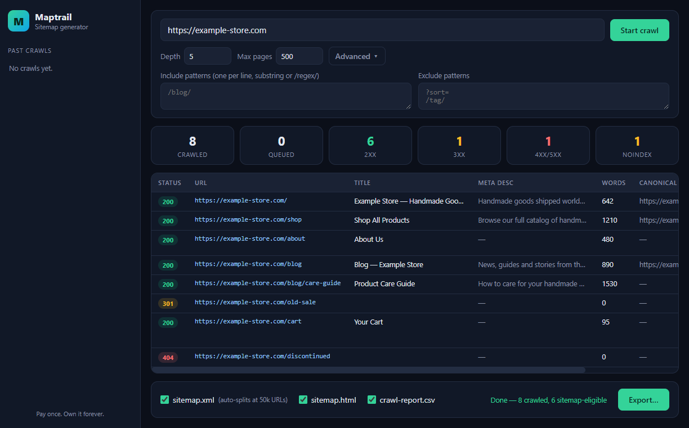

# 🗺️ Maptrail

## Get the packaged app

Don't want to build from source? Get the signed installer, lifetime updates and setup support for a one-time payment at [onetimesuite.com/maptrail](https://onetimesuite.com/maptrail/) — same app, MIT source right here.

Part of [OneTimeSuite](https://onetimesuite.com) — pay-once alternatives to subscription software.

## Demo


https://github.com/user-attachments/assets/8f4bdabb-aeab-4818-aaad-6c146e6e4fb6


[](LICENSE)

**The desktop website crawler and sitemap generator you buy once and own forever.** Point it at a URL, crawl the whole site locally, and get a standards-compliant `sitemap.xml` (auto-split into a sitemap index at 50,000 URLs), a human-readable `sitemap.html`, and a full CSV SEO report — titles, meta descriptions, status codes, word counts, canonicals, noindex flags. 100% local, zero subscription, zero cloud, zero telemetry.

Screaming Frog charges **£199/year, forever**, for a crawler most people use to do one thing: audit a site and ship a sitemap. Maptrail is **$19 once**. Your sitemap is not a subscription.



## ☕ Skip the setup — get the 1-click installer

Don't want to touch a terminal? Grab the packaged Windows installer (and support development):

**→ [Get Maptrail on Whop](https://whop.com/benjisaiempire/maptrail)** — pay once, own it forever.

## Features

- 🕷️ **Local breadth-first crawler** — enter a URL and crawl the entire site from your machine with a configurable concurrency pool; live progress table shows URL, status, depth, title, meta description length, H1, word count, canonical, and noindex flag as pages come in
- 🎛️ **Depth, limit & pattern controls** — set max crawl depth and page limit, plus include/exclude URL patterns (plain substrings or `/regex/`) to skip `/tag/`, `?sort=` and friends
- 📄 **Standards-compliant `sitemap.xml`** — with `lastmod` taken from real `Last-Modified` headers and `priority` scaled by crawl depth (floored at 0.3)
- 🗂️ **Automatic sitemap-index chunking** — sites over 50,000 URLs are split into numbered sitemap files plus a `sitemap-index.xml`, exactly per the sitemaps.org spec (verified in tests with a 60,001-URL crawl)
- 🧭 **Human-readable `sitemap.html`** — a linked, titled page listing for visitors (and for you)
- 📊 **CSV SEO report** — every crawled page with status, title, meta description, H1, word count, canonical, and noindex — *including* the 404s and noindexed pages the XML sitemap correctly leaves out, so you can actually fix them
- 🚫 **Correct noindex / 404 handling** — `meta robots noindex` pages and non-200 responses are excluded from the sitemap but kept in the report
- 💾 **Crawl history** — every crawl is saved locally (SQLite via Node's built-in `node:sqlite`, with an automatic JSON fallback) so you can reload, re-export, or delete past crawls
- ⏹️ **Cancel anytime** — long crawls stop cleanly and keep what they found
- 🌑 Premium dark UI, fast and framework-free

## Quick start

```bash
git clone https://github.com/bensblueprints/sitemap-generator
cd sitemap-generator
npm i
npm start
```

Run the tests (crawler against a real local test server, 50k chunking, HTML sitemap, CSV export, store round-trip — 31 assertions):

```bash
npm test
```

Build the Windows installer:

```bash
npm run dist
```

## Maptrail vs Screaming Frog

| | **Maptrail** | Screaming Frog SEO Spider |
|---|---|---|
| Price | **$19 once** | £199/yr (≈$250/yr) |
| Cost after 1 year | **$19** | ≈$250 |
| Cost after 3 years | **$19** (39x cheaper) | ≈$750 |
| Sitemap.xml + 50k index chunking | **Yes** | Yes |
| HTML sitemap | **Yes** | No |
| CSV crawl/SEO report | **Yes** | Yes |
| Free-tier URL cap | **None — no tiers** | 500 URLs |
| Your crawl data lives | **On your machine** | On your machine |
| Account / license server | **No** | Yearly license key |
| Telemetry | **None** | Update pings |
| Source code | **MIT, right here** | Closed |

**Pays for itself in under 1 month** of a Screaming Frog license — and every year after that is pure savings. (Screaming Frog does far more than sitemaps — log-file analysis, JS rendering, integrations. If you need all that, buy it. If you need clean sitemaps and a crawl report, you need Maptrail, once.)

## Tech stack

- **Electron** — main + preload (context-isolated) + plain HTML/CSS/JS renderer. No framework, no build step.
- **Pure Node crawler** (`src/crawler.js`) — breadth-first with a concurrency pool, built on native `fetch` + [cheerio](https://cheerio.js.org/) for parsing; runs identically under Electron and plain Node for tests.
- **Sitemap engine** (`src/sitemap.js`) — XML escaping, lastmod/priority, 50k-URL index chunking, HTML sitemap, CSV report.
- **Crawl store** (`src/store.js`) — Node's built-in `node:sqlite` (no native builds) with a same-API JSON fallback.
- **electron-builder** — Windows NSIS installer.

## Data & privacy

Everything runs on your machine. Maptrail makes network requests **only to the site you tell it to crawl** — no telemetry, no update pings, no accounts. Crawl history lives in a local SQLite file; exports go wherever you choose to save them.

## License

[MIT](LICENSE) © 2026 Ben (bensblueprints)

## macOS build

See [MAC-BUILD.md](MAC-BUILD.md). Quickest path: GitHub **Actions** tab -> run the **Mac Build** (`mac-build.yml`) workflow to get a downloadable `.dmg` (unsigned - right-click -> Open on first launch).
